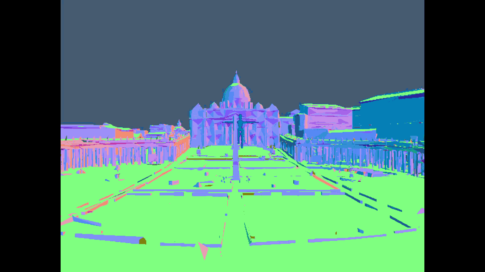

# Aidan Ream
<!--Graphics Project GIF-->

---

## About me

- LAES Undergraduate at Calpoly Slo
- Concentration in Graphic Programming 
- Currently working with 4D Gaussian Splatts

## Featured work

**PLACEHOLDER**
## Languages

`java` · `python` · `c++` `javascript` · `react` 

## Software 

 `blender` · `maya` · `photoshop` · `illustrator` · `renderdoc` · `meshlab` 

## Libraries and Game Engines

 `nodejs` · `unity` · `opengl` · `vulkan` 
 
## Reach out!

- 📨 Email: aidanream01@gmail.com
<!--- 🌐 Site: https://your-website.example-->
- 💼 LinkedIn: https://linkedin.com/in/aidan-ream/
